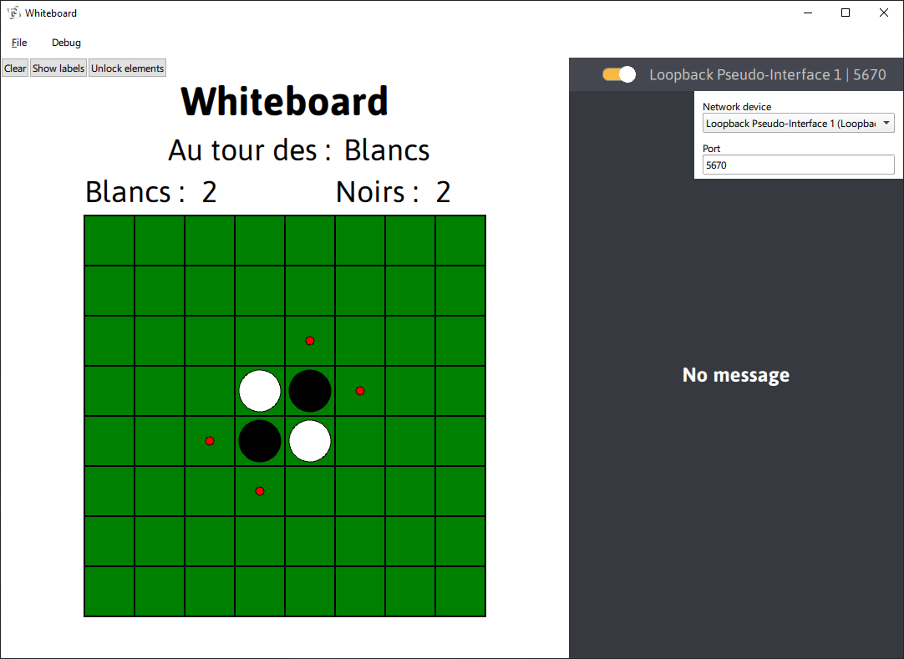
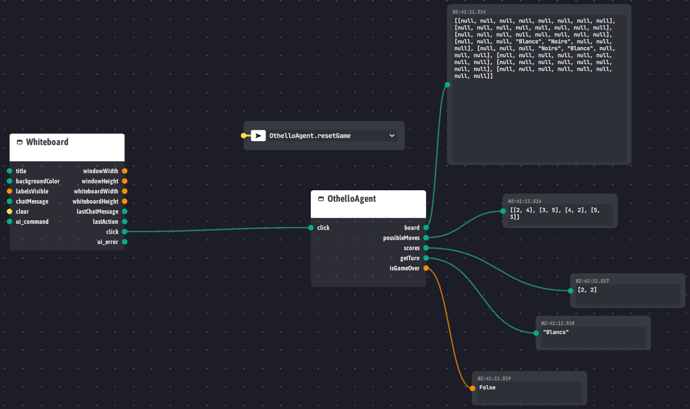

# N7_3A_Othello

A basic [Othello](https://en.wikipedia.org/wiki/Reversi) game implemented in Python with an [Ingescape](https://ingescape.com/) agent using [Whiteboard](https://gitlab.ingescape.com/learn/whiteboard) for its U/I.




# Installing and running

## OthelloAgent

```bash
# Create a venv
python -m venv venv

# Activate it
source venv/bin/activate

# Install requirements
pip install -r ./requirements.txt

# Running the agent
python ./src/OthelloAgent.py
```

## Whiteboard

Run the Whiteboard application and press the `Lock elements` button in the top left corner to avoid moving the elements by mistake.

# Ingescape Circle

A `.igssystem` file is provided to easily import the Othello system into [Ingescape Circle](https://ingescape.com/circle/).



## V&V scripts

Simple verification and validation scripts are provided to test the OthelloAgent system on Circle. You can find them under `Library > Scripts`.