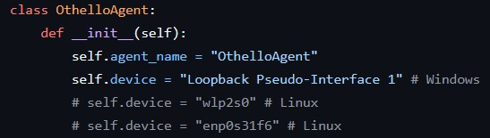

# N7_3A_Othello

A basic [Othello](https://en.wikipedia.org/wiki/Reversi) game implemented in Python with an [Ingescape](https://ingescape.com/) agent using [Whiteboard](https://gitlab.ingescape.com/learn/whiteboard) for its U/I.


[-> Watch a game exemple <-](game_exemple.mp4)

## Features available

- The game is functional: players can place their paws alternately
- The turn is indicated: players know whose turn it is to play
- Possible paws placements are shown for clarity
  - Additionaly, it is impossible to place a pawn on a case that is not a possible move. It ensures that no cheating is possible         and that the turn will not change until a valid move is played
- Game score is visible constantly thourough the game
- Once the game is finished, the winner is displayed

## Possible improvements

- Endgame display is not operational: we don't see the last move, only the final score. That should be adressed.
- Add a reset button
- Allow the player to choose the size of the board (we can already manually change the size of the board in the code and have a functioning game, but we didn't implement a way for the user to change it
- Add player customization: user could choose a name
- Add a scoreboard showing previous games and the number of games won by each player (recorded by player name)
- Add an option to play against the computer

# Installing and running

## OthelloAgent

```bash
# Create a venv
python -m venv venv

# Activate it
source venv/bin/activate #linux
venv\Scripts\activate #windows (cmd)
venv\Scripts\Activate.ps1 #windows (PowerShell)

# Install requirements
pip install -r ./requirements.txt

# Running the agent
python ./src/OthelloAgent.py
```

## Whiteboard

- Run the Whiteboard application and press the `Lock elements` button in the top left corner to avoid moving the elements by mistake.
- The code is currently configured to run on Windows. If you are not on Windows or need to change the interface used, change it in 
  



# Ingescape Circle

A `.igssystem` file is provided to easily import the Othello system into [Ingescape Circle](https://ingescape.com/circle/).


## V&V scripts

Simple verification and validation scripts are provided to test the OthelloAgent system on Circle. You can find them under `Library > Scripts`.

